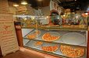

# web-optimization-may2
### Instructions
To view the portfolio and pizza website download all the files and open index.html and views/pizza.html in your browser.

Or you can view the site on github pages by using the links below.
* https://mayalhajri.github.io/web-optimization-may2/
* https://mayalhajri.github.io/web-optimization-may2/views/pizza.html

I optmiez all images by using 
1. [optimizilla](http://optimizilla.com/)  
2. download optimized image javascript and css resources for this page ,from [PageSpeed](https://developers.google.com/speed/pagespeed/insights/) 
## Critical Rendering Path
index.html achieves a PageSpeed score of at least 90 for Mobile and Desktop.\
### my page score is **Good**
**99/100** mobile\
**96/100** Desktop


### If you want to test website 
you can copy link https://mayalhajri.github.io/web-optimization-may2/ and past it on [PageSpeed](https://developers.google.com/speed/pagespeed/insights/) 


# Changes that I Made : 
## index.html
1. delet 
```html
<link href="//fonts.googleapis.com/css?family=Open+Sans:400,700" rel="stylesheet">
```
2. delet css/style.css from css folder (uncessray) 
3. Minify styel.css content and add it to ``` <style></style> ```
in index.html
4. add ``` media="print" ``` 
to
``` <link href="css/print.css" rel="stylesheet" media="print">
```
5. move all 
``` <script></script>```
to the end of index.html
6. replace all image that got from url to local image 
7. add **async**  to all ```<script></script>```  in index.html
8. replace 
```html 
 
```
to 
```html
 
```
becuace png less than jpg 
## main.js 
1. change all querySelector to  getElementById
2. change all querySelectorAll with getElementsByClassName
3. Optimized loop inside the changePizzaSizes function by : 
*  Created a pizzaElements variable to hold all of the .randomPizzaContainer elements in the document and looped through the elements to apply the new width value 
*  Moved the newwidth and dx out of the loop
```javascript
  function changePizzaSizes(size) {
    var pizzaElements = document.getElementsByClassName("randomPizzaContainer");
      var dx = determineDx(pizzaElements[0], size);
      var newwidth = (pizzaElements[0].offsetWidth + dx) + 'px';
    for (var i = 0; i < pizzaElements.length; i++) {
      pizzaElements[i].style.width = newwidth;
    }
  }
```
4. declare the pizzasDiv variable outside the loop, so only DOM call is made one.
```javascript
var pizzasDiv = document.getElementById('randomPizzas');
for (var i = 2; i < 100; i++) {
     pizzasDiv.appendChild(pizzaElementGenerator(i));
}
```
5. Optimized changePizzaSizes function by :
*  use document.documentElement.scrollTop instead of document.body.scrollTop bcs it does not work anymore
*  Declaring the phase variable (var phase;) in the initialisation of the for loop will prevent it from being created every time the loop is executed
*  Declaring the phaseNums array (var phaseNums;) that make math clculation outside the for loop will prevent it from being created every time the loop is executed 
*  declere top out of loop to avoid declar it evrey time loop is executed
*  Applied translateX() and translateZ(0) transform functions to the sliding pizza elements within the updatePositions function.
```javascript
function updatePositions() {
   frame++;
  window.performance.mark("mark_start_frame");
var items = document.getElementsByClassName('mover');
var top = (document.documentElement.scrollTop) / 1250;
var phaseNums = [
                    Math.sin(top + 0),
                    Math.sin(top + 1),
                    Math.sin(top + 2),
                    Math.sin(top + 3),
                    Math.sin(top + 4)
                  ];
 for (var i = 0, len = items.length, phase; i < len; i++) {
  phase = phaseNums[i%5];
  items[i].style.transform = "translateX("+ 100 * phase + "px) translateZ(0)";
  }
  window.performance.mark("mark_end_frame");
  window.performance.measure("measure_frame_duration", "mark_start_frame", "mark_end_frame");
  if (frame % 10 === 0) {
    var timesToUpdatePosition = window.performance.getEntriesByName("measure_frame_duration");
    logAverageFrame(timesToUpdatePosition);
  }}
  ```
  6. Generates the sliding pizzas when the page loads.
  *  Reduced the amount of sliding pizza elements generated from 200 down to 31
  *  replace document.querySelector("#movingPizzas1").appendChild(elem); with document.body.appendChild(elem)
```javascript
document.addEventListener('DOMContentLoaded', function() {
  var cols = 8;
  var s = 256;
  for (var i = 31; i--;) {
    var elem = document.createElement('img');
    elem.className = 'mover';
    elem.src = "images/pizza.png";
    elem.basicLeft = (i % cols) * s;
    elem.style.top = (Math.floor(i / cols) * s) + 'px';
    elem.style.left = (i % cols) * s + 'px'
    document.body.appendChild(elem);
  }  
  updatePositions();});
  ```
## Minify CSS and Js
* css/print.css
* js/perfmatters.js
* views/css/bootstrap-grid.css
* css/style.css
